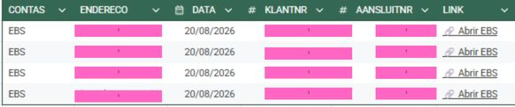
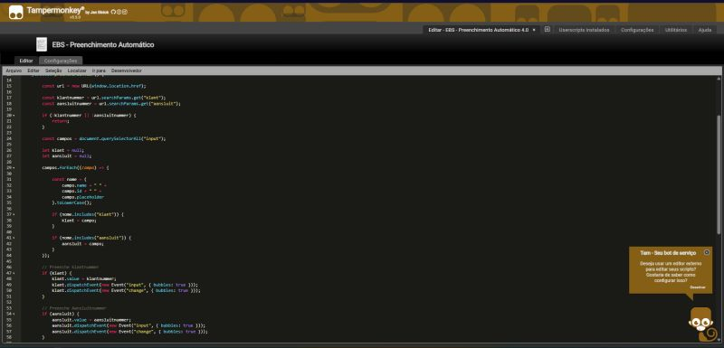
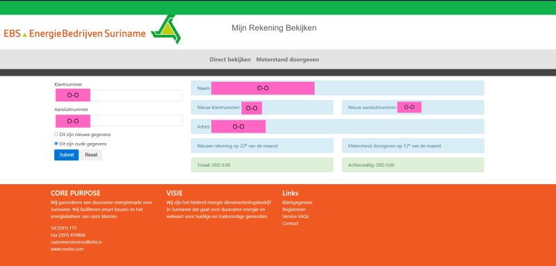

# EBS Account Automation

Browser automation created to simplify a repetitive account consultation process for EBS (EnergieBedrijven Suriname).

## 📌 About the Project

This project was created to automate a repetitive task from my daily work.

The original process required manually copying customer information from a Google Sheets spreadsheet and entering it into the EBS account consultation website.

The goal was to reduce repetitive steps and make the process faster and more efficient.

## ⚙️ How It Works

The solution combines Google Sheets with a JavaScript userscript running through Tampermonkey.

```text
Google Sheets
      │
      │ Generates a personalized URL
      ▼
EBS Account Website
      │
      │ Tampermonkey reads URL parameters
      ▼
JavaScript Automation
      │
      ├── Fills Klantnummer
      ├── Fills Aansluitnummer
      ├── Selects the correct option
      └── Clicks Submit
      ▼
Account information

## 🛠️ Technologies Used

-  JavaScript 
-  Tampermonkey 
-  Google Sheets 
-  HTML DOM manipulation 
-  Browser automation 
-  Canva (for project documentation and screenshots) 

## 💡 The Problem

The original workflow required several manual steps for every account:

1.  Copy the customer number. 
2.  Copy the connection number. 
3.  Open the EBS website. 
4.  Paste the customer number. 
5.  Paste the connection number. 
6.  Select the correct option. 
7.  Click Submit. 

When repeated several times, this became a repetitive process.

## 🚀 The Solution

A dynamic link was created in Google Sheets for each account.

The link passes the required information through URL parameters:

```
?klant=XXXXXXXX&aansluit=XXXXXXXXX
```

The Tampermonkey userscript reads these parameters and automatically fills the corresponding fields on the EBS website.

After the fields are populated, the script automatically submits the form.

This reduces the original multi-step process to a single click from the spreadsheet.

## 📊 Result

The final workflow is:

**Google Sheets → Click "Open EBS" → Automatic form filling → Automatic submission**

The project significantly reduces repetitive manual data entry and demonstrates how a small automation can solve a real-world workflow problem.

## 🔒 Privacy

No real customer information is included in this repository.

Screenshots used for documentation should have sensitive information removed or obscured.

## 📚 Learning Project

This project was created as a practical learning experience while developing my skills in programming, automation, and IT.

It was especially useful for learning how JavaScript can interact with webpage elements and how browser automation can be applied to real-world tasks.

## 👨‍💻 Author

Danubio

Learning programming, automation and IT through practical projects.
## 📸 Screenshots

### Google Sheets

The spreadsheet generates personalized links for each account.



### JavaScript / Tampermonkey

The userscript automates the EBS form.



### EBS Account Consultation

The automation fills the required information and submits the form.



```
```
